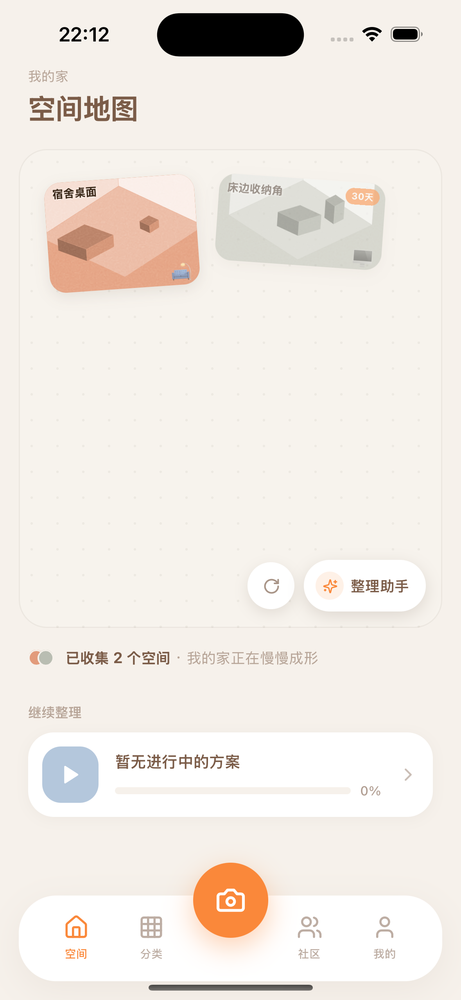
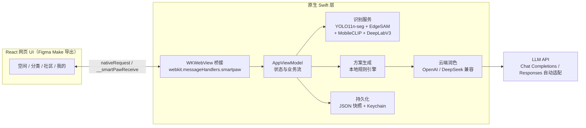

# 灵爪收纳 SmartPaw 🐾

**拍照识别物品 → 自动生成收纳方案 → 跟踪整理进度** 的 iOS 应用。

参加比赛：移动应用创新赛

<div align="center">
  
  <!-- 更多截图：docs/screenshots/ -->
</div>

## 它能做什么

1. **拍照识别**：对书桌、床边、储物角拍一张照片，本地 Core ML 模型自动分割并识别物品（手机、书本、杯子、充电线……），显示置信度
2. **生成整理方案**：按「时间预算 + 整理风格 + 目标」生成可执行的分步方案；接入大模型（DeepSeek / OpenAI 兼容接口）后，方案会带上时间规划、工具清单和更细的动作指引
3. **执行与追踪**：逐步勾选完成进度，整理前/后对比照归档到空间
4. **更多**：物品分类管理、社区真实案例（点赞/收藏/关注/评论）、整理日历、成就徽章、AI 整理助手对话

## 技术架构



- **UI**：Figma Make 设计稿一键导出 React 页面，打包进 App 由 WKWebView 加载 —— 设计迭代不用重新编译原生层
- **桥接**：17 个 `nativeRequest` 命令（数据读写、方案生成、社区互动、LLM 配置），网页与原生双向通信
- **识别**：全本地推理，离线可用；多模型互补（通用分割 + 可提示分割 + 图文对齐）
- **方案**：无网络/无 Key 时用本地规则引擎兜底，配置 Key 后自动升级为 LLM 生成
- **安全**：API Key 只存系统钥匙串，不落明文

## 快速开始

```bash
git clone https://github.com/Qszjlzz/LingZhuaShouNa.git
cd LingZhuaShouNa
open SmartPaw.xcodeproj   # Xcode 16.4+，iOS 16+ 模拟器直接 Cmd+R
```

可选：接入云端 AI 方案 —— 在 App「我的 → AI 设置」里填入任意 OpenAI 兼容服务
（如 DeepSeek：`https://api.deepseek.com/chat/completions` + `deepseek-chat`），
内置「测试连接」按钮可即时验证。

## 目录结构

```
├── App/                        # 原生层：WebView 壳、AppViewModel、Keychain
├── Services/                   # 识别、方案生成、LLM 兼容层、持久化、示例数据
├── FigmaMakeLatest/            # 网页 UI 源码（React + Vite，pnpm build）
├── Resources/
│   ├── FigmaMakeLatestWeb/     # 打包进 App 的 UI 构建产物
│   └── Models/                 # Core ML 模型（YOLO / EdgeSAM / MobileCLIP …）
├── Legacy/                     # 历史版本存档
└── SmartPawTests/              # 单元测试（识别管线、方案质量对比等）
```

## 状态与计划

- [x] 本地识别 + 规则方案 全链路可用
- [x] 云端 LLM 方案（DeepSeek 实测通过）
- [ ] 识别模型微调，提升复杂场景（杂物间）召回
- [ ] 真机 AR 实景摆放

---

*个人项目，持续更新中 ✌️*
